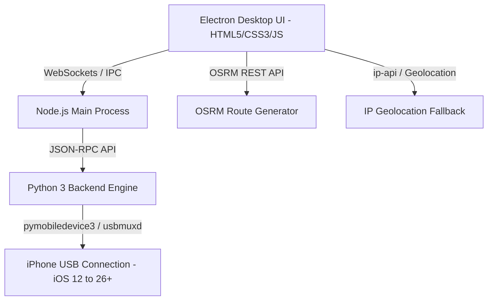

# Location Simulator v1.0.0 - Implementation Plan

Location Simulator is a premium Windows desktop application designed to simulate and spoof GPS locations on iOS devices (supporting iOS 12 through iOS 26+) connected via USB cable. It is engineered specifically for location-based applications and mobile games such as **Pokémon GO** and **Pikmin Bloom**, featuring natural humanized movement algorithms, dynamic speed variance, customizable periodic pauses, real-time map animation, step count calculation, and IP-based geolocation fallback.

---

## Technical Architecture & Core Stack



1. **Desktop App Core (Electron + Node.js)**
   - Ultra-sleek Dark Mode UI with Glassmorphic visual aesthetics.
   - Interactive Leaflet.js map with CartoDB Dark Matter tile layer.
   - Responsive telemetry overlay showing live speed, progress, remaining distance, ETA, and step count.

2. **Python Sidecar Service (`pymobiledevice3`)**
   - Communicates with iOS devices over USB via `usbmuxd`.
   - Handles Developer Disk Image (DDI) mounting and `dvt` location simulation protocol for iOS 17 - 26+.
   - Streams lat/lng coordinate updates at 1Hz–2Hz.

3. **Routing & Geolocation Service**
   - Primary location lookup via HTML5 Geolocation API; automatic fallback to IP Geolocation (`ipapi.co` / `ip-api.com`) if Windows location is disabled.
   - Route calculation via Open Source Routing Machine (OSRM) REST API supporting Foot (walking/running) and Car profiles.

4. **Humanized Movement & Step Emulation System**
   - **Speed Presets**: Walking (~4 km/h), Jogging (~9 km/h), Cycling (~15 km/h), Driving (~45 km/h), plus manual km/h input.
   - **Dynamic Speed Variance**: Toggleable Gaussian/random-walk noise (e.g. ±20% fluctuation around baseline speed) updated every tick.
   - **Natural Stopping & Pausing**: Configurable pause interval (e.g. stop every 1–2 mins) with smooth deceleration (3s ramp-down), stop duration (e.g. 5–10s pause), and smooth acceleration back to walking speed.
   - **Step Counter Calculation**: Accurately derives step count based on distance traversed and stride length (~0.75m/step with random variation), mimicking iOS Pedometer / HealthKit Adventure Sync rates.

---

## Detailed File Structure

```
d:\Location Simulator/
├── package.json                   # App version v1.0.0 & dependencies
├── README.md                      # Comprehensive project documentation
├── .gitignore                     # Node/Python git exclusion rules
├── docs/
│   └── implementation_plan.md     # Architectural implementation document
├── src/
│   ├── main/
│   │   ├── index.js               # Electron main process & Python sidecar manager
│   │   └── preload.js             # Secure IPC bridge
│   ├── renderer/
│   │   ├── index.html             # Main Glassmorphic UI container
│   │   ├── styles.css             # Design system (Dark mode, glassmorphism, animations)
│   │   ├── app.js                 # UI logic, Leaflet map setup, route handling
│   │   ├── routeEngine.js         # OSRM router & polyline interpolator
│   │   └── speedVariance.js       # Humanized speed fluctuation & pause state machine
│   └── backend/
│       ├── ios_bridge.py          # Python sidecar for USB usbmux & location simulation
│       ├── requirements.txt       # Python dependencies (pymobiledevice3, etc.)
│       └── step_calculator.py     # Step count & distance math engine
└── tests/
    ├── route.test.js              # Unit tests for route interpolation
    └── variance.test.js           # Unit tests for speed variance & pause timer
```
